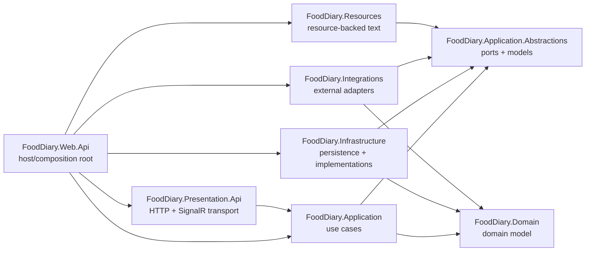
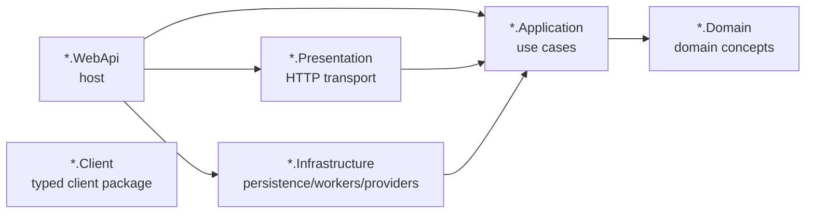

# FoodDiary Architecture

## Summary
FoodDiary is a modular monolith with separately deployed supporting services.

The primary product backend is a modular monolith:
- `FoodDiary.Domain`
- `FoodDiary.Application.Abstractions`
- `FoodDiary.Application`
- `FoodDiary.Infrastructure`
- `FoodDiary.Integrations`
- `FoodDiary.Presentation.Api`
- `FoodDiary.Web.Api`
- `FoodDiary.Resources`

Mail delivery and inbound mail are split into dedicated bounded contexts with their own hosts and databases:
- `FoodDiary.MailRelay.*`
- `FoodDiary.MailInbox.*`

Other deployable adapters are kept separate:
- `FoodDiary.JobManager`
- `FoodDiary.Telegram.Bot`
- `FoodDiary.Web.Client`

## Runtime Shape
The Docker compose setup defines these major runtime units:
- `api` - primary ASP.NET Core API host.
- `client` - Angular web client static host.
- `job-manager` - scheduled/background job host, including cleanup jobs and primary outbox processors.
- `telegram-bot` - Telegram bot worker.
- `mail-relay` - outbound email relay service.
- `mail-inbox` - inbound email service.
- `postgres`, `mailrelay-postgres`, `mailinbox-postgres` - separate PostgreSQL stores.
- `rabbitmq` - broker used by MailRelay.
- `redis` - distributed cache for API idempotency and short-lived authentication flows.
- initializer containers for database setup.

## Primary Backend Layering
Dependency direction is intentionally inward.



Core rules:
- `Domain` has no application, infrastructure, presentation, or host dependencies.
- `Application` owns use cases and depends on abstractions, domain, and mediator only.
- `Application.Abstractions` owns ports/models, not infrastructure or transport.
- `Infrastructure` implements abstractions and owns EF Core/persistence; its composition root delegates to explicit technical modules.
- `Integrations` owns external provider adapters and typed client bridges to supporting services; provider options and registrations stay in provider-specific modules.
- `Presentation.Api` owns HTTP/SignalR transport, request/response DTOs, and mapping; HTTP contracts stay in feature `Requests`/`Responses` folders.
- `Web.Api` is the executable HTTP host and composition root; it must not declare feature controllers or transport DTOs.
- `JobManager` owns recurring/background execution such as cleanup tasks, due notification scheduling, and outbox processors; it must stay free of HTTP presentation concerns.
- `Initializer` is a thin operational console host for database setup and seed/backfill operations.
- `Resources` provides resource-backed text without depending on concrete application/domain/persistence; Russian resources must keep matching neutral resources and valid encoding.

## Application Read Boundaries
Business-module ownership inside the primary backend is defined in `docs/backend/BACKEND_MODULE_OWNERSHIP.md`. Layer sharing and a shared `DbContext` do not imply shared write ownership: cross-module mutations go through the owning module, while composed reads use explicit projection/read-service contracts. Fasting introduced the executable vertical-boundary pattern; it is now applied across the governed modules, hosts/adapters and the explicit cross-module projection allowlist.

Application service composition follows the same ownership model. Root `FoodDiary.Application/DependencyInjection.cs` contains mediator/validation/cross-cutting bootstrap and delegates feature registrations to module-area partials (`Administration`, `Identity`, `Food`, `Tracking`, `Notifications`, and `Billing`). An architecture test prevents feature registrations from regrowing in the root aggregator.

Application read paths should use the narrowest contract that matches the behavior:
- `*ReadModelRepository` for projection reads, counters, summaries, and API/UI read models.
- `*LookupRepository` for narrow existence checks that do not need aggregate materialization.
- `*ReadRepository` for aggregate reads needed by domain workflows.
- `*WriteRepository` for tracked aggregate mutation paths.

Full composite `*Repository` contracts are primarily adapter conveniences. Avoid injecting them into application services and handlers when a narrower read, lookup, read-model, or write contract is available.

Current guardrails protect the migrated read-model boundaries for favorites, notifications, tracking/body metrics, lessons/content, dashboard body reads, and notification lookup checks. When adding a new read use case, prefer a dedicated read service backed by read-model contracts instead of reusing aggregate repositories directly from query handlers.

## Supporting Service Boundaries
MailRelay and MailInbox repeat the same basic layer pattern:



Rules:
- Client packages must not reference service application/domain/infrastructure/presentation/host projects.
- Primary FoodDiary core may interact with MailRelay/MailInbox through client packages only, currently from `FoodDiary.Integrations`; other core source must not reference MailRelay/MailInbox namespaces.
- MailRelay uses its own database and owns outbound delivery runtime configuration.
- MailInbox uses its own database and owns inbound SMTP/MIME runtime concerns.
- Supporting-service production projects have layer-specific package allowlists and root-folder guardrails.
- Supporting-service WebApi projects are hosts only; HTTP controllers, DTOs, and mappings live in presentation projects.
- Supporting-service infrastructure options live in infrastructure options folders, with explicit exceptions for client/application/presentation options.

## Architecture Tests
Architecture guardrails live in `tests/FoodDiary.ArchitectureTests`.

Important tests:
- `ProjectDependencyMatrixTests` is the source of truth for allowed production project references.
- `LayeringTests` protects primary backend layering.
- `MailRelayArchitectureTests` and `MailInboxArchitectureTests` protect supporting service boundaries.
- `ApplicationGuardrailTests` protects application-layer conventions.
- `AsyncMethodGuardrailTests` protects async naming and cancellation-token conventions.
- `ClientPackageBoundaryTests` protects typed service clients.
- `HostCompositionBoundaryTests` protects host-only concerns.
- Dedicated guardrail tests also protect domain shape, operational hosts, backend resources, presentation HTTP contracts, and package/root-folder placement.

Run:

```bash
dotnet test tests/FoodDiary.ArchitectureTests/FoodDiary.ArchitectureTests.csproj
```

When architecture changes intentionally, update:
- the implementation,
- architecture tests,
- relevant `AGENTS.md`,
- this document or an ADR.
