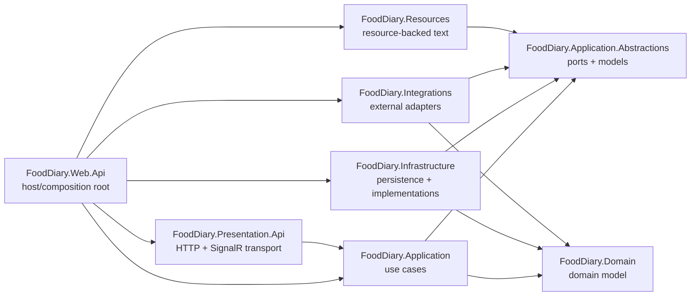
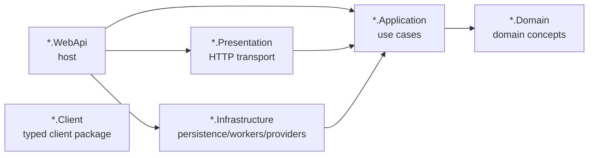

# FoodDiary Architecture

## Summary
FoodDiary is a modular monolith with separately deployed supporting services.

The primary product backend is a modular monolith:
- `FoodDiary.Domain`
- `FoodDiary.Application.Abstractions`
- `FoodDiary.Application`
- `FoodDiary.Infrastructure`
- `FoodDiary.Integrations`
- `FoodDiary.Presentation.Api`
- `FoodDiary.Web.Api`
- `FoodDiary.Resources`

Mail delivery and inbound mail are split into dedicated bounded contexts with their own hosts and databases:
- `FoodDiary.MailRelay.*`
- `FoodDiary.MailInbox.*`

Other deployable adapters are kept separate:
- `FoodDiary.JobManager`
- `FoodDiary.Telegram.Bot`
- `FoodDiary.Web.Client`

## Runtime Shape
The Docker compose setup defines these major runtime units:
- `api` - primary ASP.NET Core API host.
- `client` - Angular web client static host.
- `job-manager` - scheduled/background job host.
- `telegram-bot` - Telegram bot worker.
- `mail-relay` - outbound email relay service.
- `mail-inbox` - inbound email service.
- `postgres`, `mailrelay-postgres`, `mailinbox-postgres` - separate PostgreSQL stores.
- `rabbitmq` - broker used by MailRelay.
- initializer containers for database setup.

## Primary Backend Layering
Dependency direction is intentionally inward.



Core rules:
- `Domain` has no application, infrastructure, presentation, or host dependencies.
- `Application` owns use cases and depends on abstractions, domain, and mediator only.
- `Application.Abstractions` owns ports/models, not infrastructure or transport.
- `Infrastructure` implements abstractions and owns EF Core/persistence.
- `Integrations` owns external provider adapters and typed client bridges to supporting services.
- `Presentation.Api` owns HTTP/SignalR transport and mapping.
- `Web.Api` is the executable host and composition root.
- `Resources` provides resource-backed text without depending on concrete application/domain/persistence.

## Supporting Service Boundaries
MailRelay and MailInbox repeat the same basic layer pattern:



Rules:
- Client packages must not reference service application/domain/infrastructure/presentation/host projects.
- Primary FoodDiary core may interact with MailRelay/MailInbox through client packages only, currently from `FoodDiary.Integrations`.
- MailRelay uses its own database and owns outbound delivery runtime configuration.
- MailInbox uses its own database and owns inbound SMTP/MIME runtime concerns.

## Architecture Tests
Architecture guardrails live in `tests/FoodDiary.ArchitectureTests`.

Important tests:
- `ProjectDependencyMatrixTests` is the source of truth for allowed production project references.
- `LayeringTests` protects primary backend layering.
- `MailRelayArchitectureTests` and `MailInboxArchitectureTests` protect supporting service boundaries.
- `ApplicationGuardrailTests` protects application-layer conventions.
- `AsyncMethodGuardrailTests` protects async naming and cancellation-token conventions.
- `ClientPackageBoundaryTests` protects typed service clients.
- `HostCompositionBoundaryTests` protects host-only concerns.

Run:

```bash
dotnet test tests/FoodDiary.ArchitectureTests/FoodDiary.ArchitectureTests.csproj
```

When architecture changes intentionally, update:
- the implementation,
- architecture tests,
- relevant `AGENTS.md`,
- this document or an ADR.
