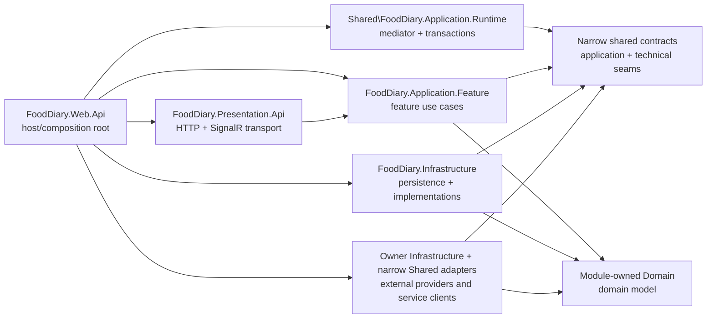
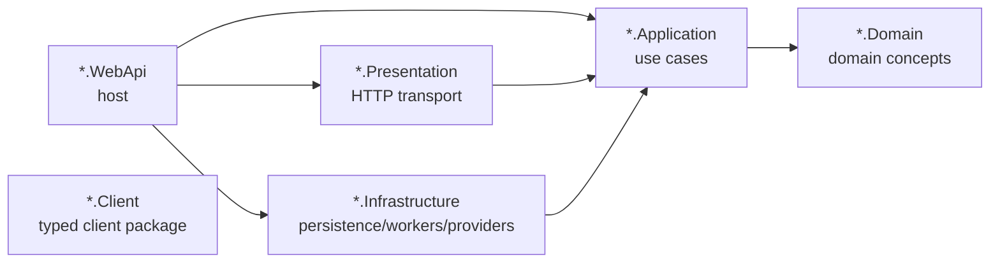

# FoodDiary Architecture

## Summary
FoodDiary is a modular monolith with separately deployed supporting services.

The primary product backend is a modular monolith:
- module-owned Domain and Domain.Contracts projects with generic shared Primitives
- narrow shared contract projects under `Shared/` (`FoodDiary.Application.Contracts`, Audit, Authentication, Email, Nutrition, and Outbox Management)
- `Shared/FoodDiary.Application.Runtime`: host-composed execution pipeline with unchanged assembly identity (ADR 0046).
- `Shared/FoodDiary.Audit.Infrastructure` and `Shared/FoodDiary.Email.Infrastructure`: explicitly composed adapters over the shared persistence session (ADR 0045).
- independently compiled `FoodDiary.Application.<Feature>` modules
- `FoodDiary.Infrastructure`
- `Shared/FoodDiary.Authentication.Infrastructure`: JWT binding and shared SSO storage; hosts register it explicitly (ADR 0044).
- `Shared/FoodDiary.Persistence.Runtime`: shared context and transaction/save coordination without module implementations; see [ADR 0043](adr/0043-persistence-runtime-assembly-and-read-facade.md)
- `FoodDiary.ReadModel.Composition`: host-registered cross-module SQL read projections
- owner-module provider adapters plus `Shared/FoodDiary.Integrations.Http` and `Shared/FoodDiary.Email.MailRelay`
- `FoodDiary.Presentation.Api`
- `FoodDiary.Web.Api`

Mail delivery and inbound mail are split into dedicated bounded contexts with their own hosts and databases:
- `FoodDiary.MailRelay.*`
- `FoodDiary.MailInbox.*`

Other deployable adapters are kept separate:
- `FoodDiary.JobManager`
- `FoodDiary.Telegram.Bot`
- `FoodDiary.Web.Client`

## Runtime Shape

Shared persistence separates its three-record runtime model from the complete
migration and composed-read model. PersistenceSession coordinates owner contexts
on one connection and transaction; see [ADR 0042](adr/0042-shared-runtime-persistence-session.md).
The Docker compose setup defines these major runtime units:
- `api` - primary ASP.NET Core API host.
- `client` - Angular web client static host.
- `job-manager` - scheduled/background job host, including cleanup jobs and primary outbox processors.
- `telegram-bot` - Telegram bot worker.
- `mail-relay` - outbound email relay service.
- `mail-inbox` - inbound email service.
- `postgres`, `mailrelay-postgres`, `mailinbox-postgres` - separate PostgreSQL stores.
- `rabbitmq` - broker used by MailRelay.
- `redis` - distributed cache for API idempotency and short-lived authentication flows.
- initializer containers for database setup.

## Primary Backend Layering
Dependency direction is intentionally inward.


```mermaid
flowchart LR
    WebApi["FoodDiary.Web.Api\nhost/composition root"] --> Presentation["FoodDiary.Presentation.Api\nHTTP + SignalR transport"]
    WebApi --> Runtime["Shared\FoodDiary.Application.Runtime\nmediator + transactions"]
    WebApi --> Modules["FoodDiary.Application.Feature\nfeature use cases"]
    WebApi --> Infrastructure["FoodDiary.Infrastructure\npersistence + implementations"]
    WebApi --> Adapters["Owner Infrastructure + narrow Shared adapters\nexternal providers and service clients"]
    Presentation --> Modules
    Runtime --> Contracts["Narrow shared contracts\napplication + technical seams"]
    Modules --> Contracts
    Modules --> Domain["Module-owned Domain\ndomain model"]
    Infrastructure --> Contracts
    Infrastructure --> Domain
    Adapters --> Contracts
    Adapters --> Domain
```

Core rules:
- `Domain` has no application, infrastructure, presentation, or host dependencies.
- Each business module owns its use cases and depends only on approved abstractions, domain types, and mediator contracts. All 34 modules have canonical `Modules/<Feature>` roots; some retain legacy `FoodDiary.Application.<Feature>` assembly identities.
- `Application.Runtime` owns mediator behaviors, transaction boundaries, and post-commit execution; it does not aggregate feature modules.
- Module-specific ports and models belong to their owning module. Cross-cutting contracts are split by concern into dependency-light projects under `Shared/`; there is no central feature-contract aggregator.
- Consumers reference the owning module or narrow shared contract project directly. `FoodDiary.Application.Contracts` contains only generic request, event, transaction, result-taxonomy, pagination, temporal, and enum-validation contracts; Audit, Authentication, Email, Nutrition, and Outbox Management have separate packages.
- `Infrastructure` implements abstractions and owns EF Core/persistence; its composition root delegates to explicit technical modules.
- Owning module Infrastructure owns external provider adapters/options. MailRelay transport and provider-neutral HTTP primitives are narrow shared adapters; Admin owns the MailInbox bridge. There is no central integration umbrella assembly.
- `FoodDiary.Presentation.Api` is the shared HTTP/SignalR kernel: base controllers, common filters, error mapping, hub identity plumbing and the version endpoint.
- `Modules/<Feature>/Presentation` owns feature controllers, endpoint-local DTOs, request mappings, hubs and module-specific transport processors; the Web API host explicitly registers and maps every module Presentation assembly.
- `Web.Api` is the executable HTTP host and composition root; it must not declare feature controllers or transport DTOs.
- `JobManager` owns recurring/background execution such as cleanup tasks, due notification scheduling, and outbox processors; it must stay free of HTTP presentation concerns.
- `Initializer` is a thin operational console host for database setup and seed/backfill operations.
- Notifications and Export infrastructure own their resource-backed text providers. Russian resources must keep matching neutral resources, formatting placeholders and valid encoding.
- Shared MSBuild settings prune non-target SkiaSharp native assets and native PDB files from build output; deployment publishes must use the destination runtime identifier.

## Application Read Boundaries

Hydration is the runtime-context pilot: its repositories use HydrationDbContext
with only HydrationEntry and HydrationOperationReceipt. The shared unit of work
coordinates both trackers on one connection and transaction. The full central
context remains the migration model and supports existing composed reads and the
user-purge bridge. This does not establish separate databases. See
[ADR 0040](adr/0040-hydration-runtime-context-pilot.md).

Dietologist-specific collaboration auditing is composed through EF's existing
`ISaveChangesInterceptor` port. The owning module registers its scoped interceptor
idempotently; central persistence appends module registrations after telemetry and
domain-event dispatch. Rules still add generic AuditEntry records to the same
SaveChanges transaction. Audit storage remains central with an exact Dietologist
Infrastructure friend assembly, not a public entity API or reverse project edge.
Module registrations must be complete before resolving a context. All executable
hosts already compose Dietologist; coordinated host rebuilds are required.

Business-module ownership inside the primary backend is defined in `docs/backend/BACKEND_MODULE_OWNERSHIP.md`. Layer sharing and a shared `DbContext` do not imply shared write ownership: cross-module mutations go through the owning module, while composed reads use explicit projection/read-service contracts. Fasting introduced the executable vertical-boundary pattern; it is now applied across the governed modules, hosts/adapters and the explicit cross-module projection allowlist.

Application service composition follows the same ownership model. `FoodDiary.Application.Runtime` registers mediator, validation, transaction, and post-commit behaviors. Each feature project owns its registration, and executable composition roots register the required modules explicitly. Fasting established the complete `Modules/<Feature>` pilot; Hydration, WeeklyGoals, Lessons, DailyAdvices, and Dietologist own their aggregates, application ports, persistence models, and adapters under `Modules/<Feature>`. Hydration Domain depends only on scalar UserId; its PersistenceModel preserves the User FK/cascade without CLR navigations, and its repository receives only the scoped HydrationEntries set (ADR 0029). Cross-module requests and results live in owner Contracts; application repository ports remain in owner Application/Abstractions. DailyAdvices exposes its established query contract through Contracts. WeeklyCheckIn, TDEE, and Statistics are application-only modules because they own orchestration and calculations but no domain aggregate, persistence port, or adapter. Statistics composes Dashboard through a direct Dashboard.Contracts reference and Body Metrics through existing read contracts instead of adding a redundant Contracts surface. Legacy CLR namespaces and assembly identities remain unchanged, and module Domain projects reference their exact module and shared Primitives owners while `UserId` belongs to Users Domain.Contracts. The former central Domain and Nutrition assemblies are retired under ADR 0027. The shared `FoodDiaryDbContext`, migration history, and model snapshot remain in central Infrastructure so the application keeps one migration host and one database. Architecture tests prevent feature-project aggregators from regrowing and enforce the intentional module boundaries.

Business use cases and HTTP adapters are physically extracted across the feature projects listed in `docs/BACKEND_MODULE_MAP.md`. Module Presentation projects reference the shared HTTP kernel and their own Application/contracts/domain surfaces. Cross-module response reuse goes through owner Presentation.Contracts (wire DTOs only) and Presentation.Mappings (pure response transformations), never foreign controller assemblies. DTO contracts may compose other DTO contracts; mappers depend only on narrow application/scalar contracts, DTOs and other pure mappers. ADR 0039 records this strict separation. Dashboard's public snapshot graph and client-dashboard query belong to Dashboard.Contracts; handlers and internal context remain in Application. Application and Presentation projects must not reference a foreign whole Application implementation. Cross-module request/result types live in the owning Contracts project; handlers, internal services and repositories remain private implementation surfaces. The executable module graph records API and owner-contract references. The complementary docs/architecture/runtime-module-boundaries.json inventory records consumer-owned ports with foreign implementations and their transaction policy; an acyclic reference graph does not prove runtime independence. Stable module-specific cross-module surfaces live in `Modules/<Feature>/Contracts` or `Application/Abstractions`; generic command/query contracts and the `ITransactionalCommand` marker live in `Shared/FoodDiary.Application.Contracts`, so the runtime mediator pipeline remains applicable without reversing project dependencies.

Application read paths should use the narrowest contract that matches the behavior:
- `*ReadModelRepository` for projection reads, counters, summaries, and API/UI read models.
- `*LookupRepository` for narrow existence checks that do not need aggregate materialization.
- `*ReadRepository` for aggregate reads needed by domain workflows.
- `*WriteRepository` for tracked aggregate mutation paths.

Full composite `*Repository` contracts are primarily adapter conveniences. Avoid injecting them into application services and handlers when a narrower read, lookup, read-model, or write contract is available.

Current guardrails protect the migrated read-model boundaries for favorites, notifications, tracking/body metrics, lessons/content, dashboard body reads, and notification lookup checks. When adding a new read use case, prefer a dedicated read service backed by read-model contracts instead of reusing aggregate repositories directly from query handlers.

Personal-data export, retention and purge responsibilities are documented in `docs/backend/PERSONAL_DATA_LIFECYCLE.md`. User deletion is a soft-delete/recovery window followed by transactional bounded purge; external image deletion remains durable through the object-deletion outbox. The isolated inbound-mail privacy and storage lifecycle is documented in `docs/backend/MAILINBOX_DATA_LIFECYCLE.md`.

Dietologist attention signals use a consumer-owned batch projection for calorie, meal-activity and weight metrics. The query handler must not compose one dashboard per client; the dedicated projection keeps database round trips bounded as the client list grows.

## Supporting Service Boundaries
MailRelay and MailInbox repeat the same basic layer pattern:


```mermaid
flowchart LR
    ServiceHost["*.WebApi\nhost"] --> ServicePresentation["*.Presentation\nHTTP transport"]
    ServiceHost --> ServiceApplication["*.Application\nuse cases"]
    ServiceHost --> ServiceInfrastructure["*.Infrastructure\npersistence/workers/providers"]
    ServicePresentation --> ServiceApplication
    ServiceInfrastructure --> ServiceApplication
    ServiceApplication --> ServiceDomain["*.Domain\ndomain concepts"]
    Client["*.Client\ntyped client package"]
```

Rules:
- Client packages must not reference service application/domain/infrastructure/presentation/host projects.
- Primary FoodDiary may interact with MailRelay/MailInbox through client packages only: `Shared/FoodDiary.Email.MailRelay` owns the MailRelay transport and Admin Infrastructure owns the MailInbox reader bridge. Other primary source must not reference MailRelay/MailInbox namespaces.
- MailRelay uses its own database and owns outbound delivery runtime configuration.
- MailInbox uses its own database and owns inbound SMTP/MIME runtime concerns.
- Supporting-service production projects have layer-specific package allowlists and root-folder guardrails.
- Supporting-service WebApi projects are hosts only; HTTP controllers, DTOs, and mappings live in presentation projects.
- Supporting-service infrastructure options live in infrastructure options folders, with explicit exceptions for client/application/presentation options.

## Architecture Tests
Architecture guardrails live in `Tooling/tests/FoodDiary.ArchitectureTests`.

Important tests:
- `ProjectDependencyMatrixTests` is the source of truth for allowed production project references.
- `LayeringTests` protects primary backend layering.
- `MailRelayArchitectureTests` and `MailInboxArchitectureTests` protect supporting service boundaries.
- `ApplicationGuardrailTests` protects application-layer conventions.
- `FoodDiary.Analyzers` protects local C# conventions during compilation, including async naming and cancellation-token requirements; solution-wide dependency and structure rules remain in `FoodDiary.ArchitectureTests`.
- `ClientPackageBoundaryTests` protects typed service clients.
- `HostCompositionBoundaryTests` protects host-only concerns.
- Dedicated guardrail tests also protect domain shape, operational hosts, backend resources, presentation HTTP contracts, and package/root-folder placement.

Run:

```bash
dotnet test Tooling/tests/FoodDiary.ArchitectureTests/FoodDiary.ArchitectureTests.csproj
```

When architecture changes intentionally, update:
- the implementation,
- architecture tests,
- relevant `AGENTS.md`,
- this document or an ADR.

## Dashboard logical extraction

`Modules/Dashboard` owns Application, Application/Abstractions, Contracts and
Infrastructure. It is a read composer with no Domain or PersistenceModel. Stable
statistics contracts retain their CLR namespaces and are referenced directly by
Statistics/WeeklyCheckIn consumers, not re-exported by central Abstractions.
Optimized projection readers own no contributing aggregates. Shared DbContext,
migrations/model snapshot and HTTP transport remain central. Hosts explicitly call
`AddDashboardReadServices` after infrastructure registration; `AddDashboardModule`
requires an independent reader and registers no recursive mediator fallback. Scoped concrete/interface aliases and
query behavior are preserved. Owned application/adapter tests live under module
tests; mixed DI/date, shared PostgreSQL and HTTP suites remain central.

## Users physical ownership

Users owns the complete User aggregate, all credential/security partials, roles,
role audit and weight/waist goals under `Modules/Users/Domain`. `UserId` lives in
`Modules/Users/Domain.Contracts`, depending only on shared primitives. Consumers
reference the exact owner; shared guards and generic values belong to
`FoodDiary.Domain.Primitives`; module-specific values stay with their owner. Authentication flows/providers, combined UserRepository,
DbContext, migrations and snapshot retain their existing owners. CLR namespaces,
security behavior and EF/HTTP contracts are unchanged. See
`docs/ai/users-domain-extraction.md` for residual seams and verification evidence.

Identity uses sibling Application, Application.Abstractions, Contracts, Domain, Infrastructure, PersistenceModel and Presentation projects under `Modules/Identity`. Assembly names and folder namespaces follow `FoodDiary.Modules.Identity.<Layer>`. Authentication and Email remain feature areas in Application. Public bootstrap and login-event cleanup requests are dispatched through the mediator; handlers retain explicit save and batch boundaries. The namespace migration preserves the relational schema and historical migration metadata.

## Admin physical ownership

Admin owns application slices, billing-report/impersonation/mail-reader ports,
AdminImpersonationSession Domain, its explicit EF model and reporting/session
adapters under Modules/Admin. Legacy application assembly and CLR namespaces
remain stable; compatibility requires coordinated host rebuilds. Email templates
remain Identity-owned and role audit/User capabilities remain Users-owned despite
legacy Admin namespaces. Shared context/migrations and SSO storage remain central;
JWT and ordinary SSO protocol implementations belong to Identity. HTTP authorization,
structured audit and MailInbox client bridge retain their established owners.
Hosts call AddAdminModule; JobManager adds only AddAdminPersistence. See
docs/ai/admin-ownership-inventory.md for current source evidence and test ownership.

## Products physical ownership

Products owns Product, ProductId contracts, product-only value objects, use cases,
ports, persistence adapters, EF model and focused tests under `Modules/Products`.
User/Product and Product/MealItem are unidirectional EF relationships; shared
context/migrations and composition lock remain central. Hosts explicitly
compose AddProductsModule; JobManager adds AddProductsPersistence without new
handlers. See `docs/ai/products-ownership-inventory.md` for the boundary and
coordinated-rebuild compatibility promise.

## Meals physical ownership

Meals owns Meal, MealItem, MealAiSession, MealAiItem, their IDs, meal-only states,
nutrition event and AI item/session enums under `Modules/Meals/Domain`, with stable
CLR namespaces. User has no inverse Meals collection; Meal.User remains a one-way
relationship with the same required FK and cascade. Shared User/UserId, enums,
DbContext, migrations and snapshot remain with their existing owners. Product,
Recipe and Image links remain ID-based with unchanged batch snapshot fallbacks.
No extra Domain.Contracts project is needed by the current acyclic graph.
See `docs/ai/meals-ownership-inventory.md` for source evidence and remaining seams.

## Residual infrastructure boundaries

See [the central Infrastructure ownership audit](architecture/infrastructure-boundary-audit.md)
for remaining module adapters, intentionally shared database mechanisms and mixed
components that require separate design. Identity owns the login-event repository
and cached email-template provider; this does not change the shared EF context or
the direction of module-to-central-Infrastructure dependencies.

Identity also owns JWT generation and password algorithms, wired as singletons by
`AddIdentityAuthenticationInfrastructure` in API, Initializer and JobManager. Users
retains credential operations/state; JwtOptions and API validation keep their
owners. Email outbox remains a technical queue for prepared messages from Identity
and Dietologist. See `docs/ai/identity-authentication-adapters.md`.

Ordinary Admin SSO also belongs to Identity's authentication registration. The
shared one-time store/Redis selection and Admin impersonation protocol retain
their owners; see `docs/ai/identity-sso-ownership.md`. No host, EF or HTTP behavior
changes accompany this physical move.

## Persistence capabilities

One shared DbContext, ChangeTracker, unit of work and migration history remain intentional. Module adapter access is reviewed in `docs/architecture/persistence-capabilities.json` and checked against current Roslyn source evidence by `PersistenceCapabilityTests`. New entity access, writes, tracked queries and context escape APIs require an explicit review. Adapters with SQL/ChangeTracker/context access also carry a source fingerprint, so an existing Database permission cannot silently authorize new SQL.

This is a source guardrail, not a runtime authorization boundary or a proof about dynamic reflection. Authentication and tenant predicates remain in the existing use cases and queries. Start new simple adapters with owner-scoped sets when that preserves transactions; Hydration is the verified pilot. Preserve aggregate invariants before extending this pattern elsewhere.

## Owner lifecycle and transaction entry

ADR 0030 refines the remaining shared-context boundaries: Users coordinates
owner-side purge participants; Recipes reads immutable product snapshots; Products
and Recipes keep scalar foreign keys with unchanged relational mappings. Meals
supplies TDEE daily calories independently of Dashboard. Top-level transaction
runners reject pending caller changes and existing transactions. The module graph
records direct owner-contract references alongside Application API edges.
ADR 0031 removes the previously acknowledged combined cycles. See
`docs/adr/0030-owner-lifecycle-and-transaction-boundaries.md` for scope and invariants.

## Contract and aggregate isolation

ADR 0031 completes the contract-cycle and foreign-navigation follow-up to ADR 0030.
The combined Application/service-contract graph is acyclic. Foreign domain links are
scalar IDs; immutable snapshots and no-tracking joins supply display/nutrition data.
Meals owns nutrition aggregation. FD0015/FD0016 enforce module EF ownership and exact
reviewed technical escapes during compilation. The database, FK behavior and public
API remain shared/compatible. See `docs/adr/0031-acyclic-contracts-and-scalar-aggregate-links.md`.

Retry and image-reference boundaries follow [ADR 0032](adr/0032-retry-isolation-and-image-reference-integrity.md): fresh attempt state, isolated orphan cleanup, restrictive image FKs and immutable Images service contracts.

See [ADR 0033](adr/0033-retry-safe-outbox-and-consumer-contracts.md) for retry-safe Wearables/replay, outbox claim-owner fencing and the narrow cross-module consumer APIs.

## Current execution and projection boundaries

Products and Recipes use Serializable top-level transactions with whole-attempt retries, replacing the global composition lock. Users supplies persisted no-tracking consumer profiles; its tracked aggregate service remains owner-local. Meals owns the tenant-scoped batch ingredient display projection consumed by Dashboard. See ADR 0035 for invariants, verification and coordinated rollout.

## Bug triage supporting service

`Services/BugTriage/` is an independent operational service with its own database. Only its Infrastructure references MailInbox.Client. MailInbox exports generic mail data and never owns defect investigation or Git execution. See ADR 0036 and `docs/backend/BUG_TRIAGE.md`.

BodyMetrics is the second module with an owned runtime context (ADR 0040). Weight and waist repositories use only its owned sets; Users retains goals. Shared UoW coordinates central, Hydration and BodyMetrics contexts; central migration/read/purge mappings remain.

BodyMetrics is the second module with an owned runtime context (ADR 0040). Weight and waist repositories use only its owned sets; Users retains goals. Shared UoW coordinates central, Hydration and BodyMetrics contexts; central migration/read/purge mappings remain.

Exercises extends the owned runtime contexts to three modules (ADR 0040), sharing the same scoped connection and UoW. Central migration/read/purge mappings remain.

Cycles is the fourth runtime-context owner (ADR 0040). Its profile and seven child mappings share the existing UoW; central migration/read/purge bridges remain unchanged.

Fasting also owns its five-entity runtime `FastingDbContext`; narrow repository sets
participate in the shared unit of work. Standalone telemetry bulk cleanup and
central migration ownership are retained (ADR 0040).

RecipeCommunity (two entities) and MealPlanning (six entities) also own runtime
write contexts. MealPlanning delegates composed recipe/product reads through its port to
ReadModel.Composition; user purge and migrations remain central. See ADR 0040.

Lessons owns its two-entity runtime `LessonsDbContext`. Its repository receives only
NutritionLesson and UserLessonProgress sets from that context; publication, locale
filters and completion-count SQL stay together. Shared unit-of-work saving, central
migrations and User cascade relationships remain unchanged (ADR 0040).

DailyAdvices owns a single-entity runtime context for its no-tracking advice
projections. Initializer seeding and historical migrations remain central;
locale normalization and result ordering are unchanged (ADR 0040).

Marketing owns a single-entity runtime context and injects only its attribution
DbSet into repositories. Shared saves retain event/conversion uniqueness; the
existing retention job still executes immediate bounded deletion batches.
Central migrations and reporting behavior are unchanged (ADR 0040).

OpenFoodFacts owns its cache runtime context. Immediate SQL upsert and cache reads
synchronize with the live shared transaction supplied by registration, including
transactions opened after repository resolution. Central migrations remain;
provider calls, ranking and cache counter semantics are unchanged (ADR 0040).

USDA owns a five-entity runtime read context. Its repository receives only owned
sets for food, nutrient links, portions and reference values; nutrient navigation
stays within the model. Central import and migrations remain (ADR 0040).

ContentReports owns a single-entity runtime context and report writes. The host
composition implements its existing read-model and target-read ports, preserving
visibility predicates, SQL paging and bounded title/comment excerpts. No module
references the composition implementation; central migrations remain (ADR 0040).
