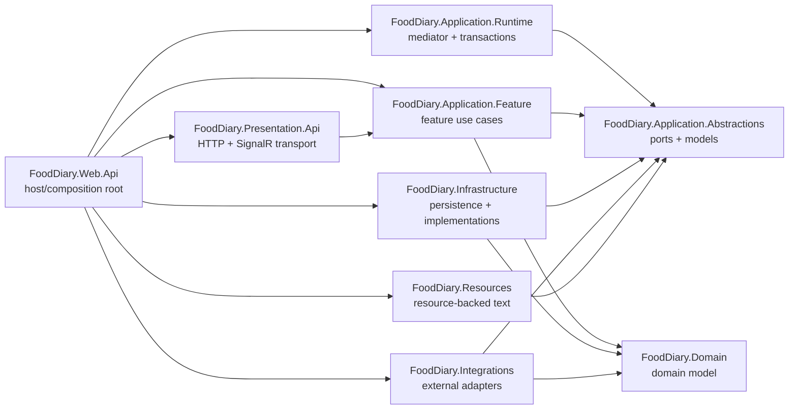
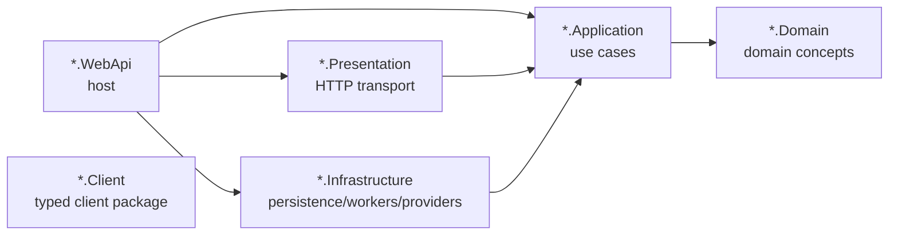

# FoodDiary Architecture

## Summary
FoodDiary is a modular monolith with separately deployed supporting services.

The primary product backend is a modular monolith:
- `FoodDiary.Domain`
- `FoodDiary.Application.Abstractions`
- `FoodDiary.Application.Runtime`
- independently compiled `FoodDiary.Application.<Feature>` modules
- `FoodDiary.Infrastructure`
- `FoodDiary.Integrations`
- `FoodDiary.Presentation.Api`
- `FoodDiary.Web.Api`
- `FoodDiary.Resources`

Mail delivery and inbound mail are split into dedicated bounded contexts with their own hosts and databases:
- `FoodDiary.MailRelay.*`
- `FoodDiary.MailInbox.*`

Other deployable adapters are kept separate:
- `FoodDiary.JobManager`
- `FoodDiary.Telegram.Bot`
- `FoodDiary.Web.Client`

## Runtime Shape
The Docker compose setup defines these major runtime units:
- `api` - primary ASP.NET Core API host.
- `client` - Angular web client static host.
- `job-manager` - scheduled/background job host, including cleanup jobs and primary outbox processors.
- `telegram-bot` - Telegram bot worker.
- `mail-relay` - outbound email relay service.
- `mail-inbox` - inbound email service.
- `postgres`, `mailrelay-postgres`, `mailinbox-postgres` - separate PostgreSQL stores.
- `rabbitmq` - broker used by MailRelay.
- `redis` - distributed cache for API idempotency and short-lived authentication flows.
- initializer containers for database setup.

## Primary Backend Layering
Dependency direction is intentionally inward.


```mermaid
flowchart LR
    WebApi["FoodDiary.Web.Api\nhost/composition root"] --> Presentation["FoodDiary.Presentation.Api\nHTTP + SignalR transport"]
    WebApi --> Runtime["FoodDiary.Application.Runtime\nmediator + transactions"]
    WebApi --> Modules["FoodDiary.Application.Feature\nfeature use cases"]
    WebApi --> Infrastructure["FoodDiary.Infrastructure\npersistence + implementations"]
    WebApi --> Integrations["FoodDiary.Integrations\nexternal adapters"]
    WebApi --> Resources["FoodDiary.Resources\nresource-backed text"]
    Presentation --> Modules
    Runtime --> Abstractions["FoodDiary.Application.Abstractions\nports + models"]
    Modules --> Abstractions
    Modules --> Domain["FoodDiary.Domain\ndomain model"]
    Infrastructure --> Abstractions
    Infrastructure --> Domain
    Integrations --> Abstractions
    Integrations --> Domain
    Resources --> Abstractions
```

Core rules:
- `Domain` has no application, infrastructure, presentation, or host dependencies.
- Each business module owns its use cases and depends only on approved abstractions, domain types, and mediator contracts. Most remain `Application.<Feature>` projects; incrementally extracted modules may use a canonical `Modules/<Feature>` root.
- `Application.Runtime` owns mediator behaviors, transaction boundaries, and post-commit execution; it does not aggregate feature modules.
- `Application.Abstractions` owns ports/models, not infrastructure or transport.
- `Infrastructure` implements abstractions and owns EF Core/persistence; its composition root delegates to explicit technical modules.
- `Integrations` owns external provider adapters and typed client bridges to supporting services; provider options and registrations stay in provider-specific modules.
- `Presentation.Api` owns HTTP/SignalR transport, request/response DTOs, and mapping; HTTP contracts stay in feature `Requests`/`Responses` folders.
- `Web.Api` is the executable HTTP host and composition root; it must not declare feature controllers or transport DTOs.
- `JobManager` owns recurring/background execution such as cleanup tasks, due notification scheduling, and outbox processors; it must stay free of HTTP presentation concerns.
- `Initializer` is a thin operational console host for database setup and seed/backfill operations.
- `Resources` provides resource-backed text without depending on concrete application/domain/persistence; Russian resources must keep matching neutral resources and valid encoding.
- Shared MSBuild settings prune non-target SkiaSharp native assets and native PDB files from build output; deployment publishes must use the destination runtime identifier.

## Application Read Boundaries
Business-module ownership inside the primary backend is defined in `docs/backend/BACKEND_MODULE_OWNERSHIP.md`. Layer sharing and a shared `DbContext` do not imply shared write ownership: cross-module mutations go through the owning module, while composed reads use explicit projection/read-service contracts. Fasting introduced the executable vertical-boundary pattern; it is now applied across the governed modules, hosts/adapters and the explicit cross-module projection allowlist.

Application service composition follows the same ownership model. `FoodDiary.Application.Runtime` registers mediator, validation, transaction, and post-commit behaviors. Each feature project owns its registration, and executable composition roots register the required modules explicitly. Fasting established the complete `Modules/<Feature>` pilot; Hydration, WeeklyGoals, Lessons, DailyAdvices, and Dietologist own their aggregates, application ports, persistence models, and adapters under `Modules/<Feature>`. Hydration keeps a one-way aggregate navigation to central `User` and intentionally has no inverse `User.HydrationEntries` collection. Dietologist deliberately keeps no Contracts project: its current consumers use mediator requests or application abstractions, and introducing another public surface would not represent proven ownership. DailyAdvices likewise has no Contracts layer because Dashboard consumes it through the mediator/query boundary. WeeklyCheckIn, TDEE, and Statistics are application-only modules because they own orchestration and calculations but no domain aggregate, persistence port, or adapter. Statistics composes Dashboard and Body Metrics projections through central application read contracts instead of adding a redundant Contracts surface. Legacy CLR namespaces and assembly identities remain unchanged, and module Domain projects reference central Domain one-way while shared `UserId` remains centralized. The shared `FoodDiaryDbContext`, migration history, and model snapshot remain in central Infrastructure so the application keeps one migration host and one database. Architecture tests prevent feature-project aggregators from regrowing and enforce the intentional module boundaries.

Business use cases are physically extracted across the feature projects listed in `docs/BACKEND_MODULE_MAP.md`. They reference application-facing abstractions, domain where required, and the shared mediator, never another application implementation as a shortcut. Stable module-specific cross-module surfaces may live in `Modules/<Feature>/Contracts`; shared command/query contracts and the `ITransactionalCommand` marker remain in `FoodDiary.Application.Abstractions`, so the runtime mediator pipeline remains applicable without reversing project dependencies.

Application read paths should use the narrowest contract that matches the behavior:
- `*ReadModelRepository` for projection reads, counters, summaries, and API/UI read models.
- `*LookupRepository` for narrow existence checks that do not need aggregate materialization.
- `*ReadRepository` for aggregate reads needed by domain workflows.
- `*WriteRepository` for tracked aggregate mutation paths.

Full composite `*Repository` contracts are primarily adapter conveniences. Avoid injecting them into application services and handlers when a narrower read, lookup, read-model, or write contract is available.

Current guardrails protect the migrated read-model boundaries for favorites, notifications, tracking/body metrics, lessons/content, dashboard body reads, and notification lookup checks. When adding a new read use case, prefer a dedicated read service backed by read-model contracts instead of reusing aggregate repositories directly from query handlers.

Personal-data export, retention and purge responsibilities are documented in `docs/backend/PERSONAL_DATA_LIFECYCLE.md`. User deletion is a soft-delete/recovery window followed by transactional bounded purge; external image deletion remains durable through the object-deletion outbox. The isolated inbound-mail privacy and storage lifecycle is documented in `docs/backend/MAILINBOX_DATA_LIFECYCLE.md`.

Dietologist attention signals use a consumer-owned batch projection for calorie, meal-activity and weight metrics. The query handler must not compose one dashboard per client; the dedicated projection keeps database round trips bounded as the client list grows.

## Supporting Service Boundaries
MailRelay and MailInbox repeat the same basic layer pattern:


```mermaid
flowchart LR
    ServiceHost["*.WebApi\nhost"] --> ServicePresentation["*.Presentation\nHTTP transport"]
    ServiceHost --> ServiceApplication["*.Application\nuse cases"]
    ServiceHost --> ServiceInfrastructure["*.Infrastructure\npersistence/workers/providers"]
    ServicePresentation --> ServiceApplication
    ServiceInfrastructure --> ServiceApplication
    ServiceApplication --> ServiceDomain["*.Domain\ndomain concepts"]
    Client["*.Client\ntyped client package"]
```

Rules:
- Client packages must not reference service application/domain/infrastructure/presentation/host projects.
- Primary FoodDiary core may interact with MailRelay/MailInbox through client packages only, currently from `FoodDiary.Integrations`; other core source must not reference MailRelay/MailInbox namespaces.
- MailRelay uses its own database and owns outbound delivery runtime configuration.
- MailInbox uses its own database and owns inbound SMTP/MIME runtime concerns.
- Supporting-service production projects have layer-specific package allowlists and root-folder guardrails.
- Supporting-service WebApi projects are hosts only; HTTP controllers, DTOs, and mappings live in presentation projects.
- Supporting-service infrastructure options live in infrastructure options folders, with explicit exceptions for client/application/presentation options.

## Architecture Tests
Architecture guardrails live in `tests/FoodDiary.ArchitectureTests`.

Important tests:
- `ProjectDependencyMatrixTests` is the source of truth for allowed production project references.
- `LayeringTests` protects primary backend layering.
- `MailRelayArchitectureTests` and `MailInboxArchitectureTests` protect supporting service boundaries.
- `ApplicationGuardrailTests` protects application-layer conventions.
- `FoodDiary.Analyzers` protects local C# conventions during compilation, including async naming and cancellation-token requirements; solution-wide dependency and structure rules remain in `FoodDiary.ArchitectureTests`.
- `ClientPackageBoundaryTests` protects typed service clients.
- `HostCompositionBoundaryTests` protects host-only concerns.
- Dedicated guardrail tests also protect domain shape, operational hosts, backend resources, presentation HTTP contracts, and package/root-folder placement.

Run:

```bash
dotnet test tests/FoodDiary.ArchitectureTests/FoodDiary.ArchitectureTests.csproj
```

When architecture changes intentionally, update:
- the implementation,
- architecture tests,
- relevant `AGENTS.md`,
- this document or an ADR.

## Dashboard logical extraction

`Modules/Dashboard` owns Application, Application/Abstractions, Contracts and
Infrastructure. It is a read composer with no Domain or PersistenceModel. Stable
statistics contracts retain their CLR namespaces and are referenced one-way by
central Abstractions for Statistics/Cycles/WeeklyCheckIn/Tdee/Gamification consumers.
Optimized projection readers own no contributing aggregates. Shared DbContext,
migrations/model snapshot and HTTP transport remain central. Hosts explicitly call
`AddDashboardReadServices` after infrastructure registration; Application fallback
registration remains `AddDashboardModule`. Scoped concrete/interface aliases and
query behavior are preserved. Owned application/adapter tests live under module
tests; mixed DI/date, shared PostgreSQL and HTTP suites remain central.

## Users physical ownership

Users application slices, application-owned services, focused tests, persistence adapters, cleanup, and the explicit User/Role/UserRole/UserRoleAuditEvent EF model live under `Modules/Users`. The application project preserves `FoodDiary.Application.Users` as its AssemblyName and RootNamespace. Central `FoodDiary.Application.Abstractions/Users`, the User aggregate and related CLR types, `UserRepository`, the shared DbContext, migrations, and snapshot remain compatibility seams because current consumers and bidirectional navigations prevent a one-way extraction. Identity remains outside this move: credentials, password/reset/email-confirmation/security state, authentication ports and services, external login/token issuance, refresh-token/login-event persistence, and email templates remain central Identity responsibilities. Hosts compose `AddUsersModule`; no schema delta or migration is introduced.

Identity application ownership is physically grouped under `Modules/Identity/Application`, while preserving the `FoodDiary.Application.Identity` AssemblyName, RootNamespace, public types, and `AddIdentityModule` composition contract. Authentication and Email remain logical areas in that one application project. Shared Authentication/Email abstractions, the User CLR/security graph, combined `UserRepository`, refresh-token/login-event entities and persistence, shared DbContext, migrations/snapshot, provider integrations, HTTP transport, and executable hosts remain with their current owners. The physical extraction has no EF model delta and introduces no migration.

## Admin physical ownership

Admin owns application slices, billing-report/impersonation/mail-reader ports,
AdminImpersonationSession Domain, its explicit EF model and reporting/session
adapters under Modules/Admin. Legacy application assembly and CLR namespaces
remain stable; compatibility requires coordinated host rebuilds. Email templates
remain Identity-owned and role audit/User capabilities remain Users-owned despite
legacy Admin namespaces. Shared context/migrations/cleanup, SSO store/JWT providers,
HTTP authorization, structured audit and MailInbox client bridge remain central.
Hosts call AddAdminModule; JobManager adds only AddAdminPersistence. See
docs/ai/admin-ownership-inventory.md for current source evidence and test ownership.

## Products physical ownership

Products use cases, ports, consumed contracts, persistence adapters and EF model
live under `Modules/Products`; focused application, Product invariant and repository PostgreSQL tests live under its nested
tests folder. Central Product/User/RecipeIngredient/MealItem/USDA CLR navigations,
shared context/migrations and composition lock remain unchanged. Hosts explicitly
compose AddProductsModule; JobManager adds AddProductsPersistence without new
handlers. See `docs/ai/products-ownership-inventory.md` for the boundary and
coordinated-rebuild compatibility promise.

## Meals physical ownership

Meals use cases, owner ports, consumed contracts, persistence adapter and EF model
live under `Modules/Meals`; focused application, invariant and repository PostgreSQL
tests live under its nested tests folder. Meal/MealItem/MealAiSession/MealAiItem stay
in central Domain because `User.Meals`, Product/Recipe MealItems and their inverse
navigations are a public bidirectional graph. UserConfiguration, user cleanup, the
shared DbContext, migrations and snapshot remain central. API and Initializer compose
`AddMealsModule`; JobManager adds `AddMealsPersistence` only. Legacy application
assembly/CLR identity and HTTP/Swagger behavior are preserved. See
`docs/ai/meals-ownership-inventory.md` for the evidence and compatibility boundary.
